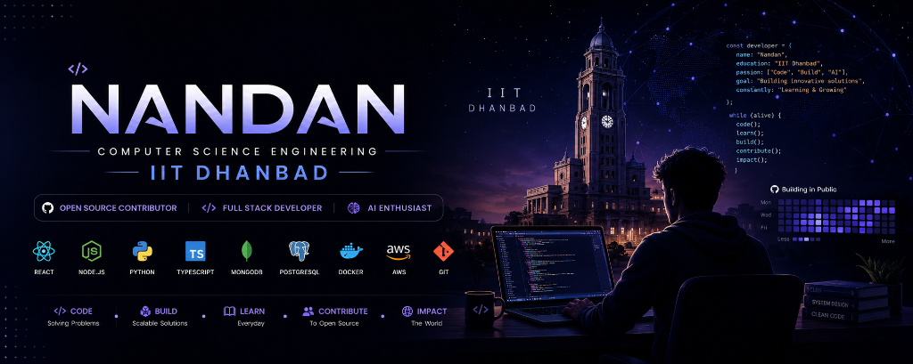

<!-- BACK-TO-TOP LINK -->

<!-- BANNER IMAGE -->

  

<!-- GREETING & TYPING BANNER -->
<h1 align="center">Hi there, I'm Nandan Sai! 👋</h1>

  

  <strong>Building AI-powered tools, scalable full-stack applications, and algorithmic systems.</strong>

<!-- SOCIAL LINKS -->

  &nbsp;
  &nbsp;
  &nbsp;
  

## 🚀 About Me

I am a Computer Science & Engineering undergraduate at the **Indian Institute of Technology (ISM), Dhanbad** (Batch of 2025–2029), originally from Hyderabad, Telangana. I love shipping end-to-end projects—ranging from optimizing complex greedy graph algorithms to orchestrating workflows on the cloud. 

- 🏫 **Academic:** CSE Undergrad at IIT (ISM) Dhanbad.
- 💡 **Interests:** Full-Stack Development, AI/ML Tooling, Cloud Integrations, and Algorithmic Optimizations.
- 💻 **Stack Preference:** Node.js, Express, and MongoDB on the backend; Vanilla JS, CSS3, and React/Next.js on the frontend.
- 🤝 **Community:** Volunteered at **Agent Slam** (AI/ML event by CSE Dept) and **Srijan** (IIT-ISM's Flagship Cultural Fest).

 

## 🛠️ Tech Stack & Skills

Here is an organized overview of the technologies, tools, and frameworks I work with:

| Category | Technologies |
| :--- | :--- |
| **Languages** |      |
| **Frontend** |      |
| **Backend** |    |
| **Databases** |    |
| **Cloud & AI** |     |
| **Tools** |     |

 

## 🛠️ Selected Work

Here are the projects that highlight my technical skills, engineering approach, and problem-solving abilities.

### 💸 [NovaSync](https://github.com/Nandansai08/NovaSync) — *Featured*
> **Smart Group Expense Splitter & Finance Optimizer**
>
>    

- Built a web application designed to eliminate the complexity of shared group finances.
- Engineered a **greedy graph algorithm** to optimize settlement transactions, successfully reducing potential transfers from $N \times (N-1)$ down to a maximum of $N-1$ flows.
- Features JWT authentication, versatile splits (equal, exact, percentage), recurring expenses, and automated settlement plans.
- 🔗 [GitHub Repository](https://github.com/Nandansai08/NovaSync) | [Live Demo](https://novasync.onrender.com)

---

### 🌐 [TerraFlow](https://github.com/Nandansai08/terraflow) — *Featured*
> **Interactive scale WebGL/Cesium 3D Earth Memory Globe**
>
>    

- Developed the "memory layer of Earth"—a full-screen interactive 3D globe using Cesium and WebGL to pin, discover, and share geo-tagged physical memories.
- Crafted a scale backend featuring WebSockets (Socket.IO) for real-time interactivity and spatial clustering using Uber's **H3 spatial index** at globe scale.
- Implemented public exploration mechanics alongside secure user authentication for managing publishing rights and geolocated media storage.
- 🔗 [GitHub Repository](https://github.com/Nandansai08/terraflow)

---

### 💼 [TenderWise AI](https://github.com/Nandansai08/tender-ai-evaluator)
> **AI-assisted procurement review workspace and tender evaluator**
>
>   

- Developed an intelligent parser that extracts requirements from complex tender documents (PDFs, DOCXs, and images).
- Utilized **Azure Document Intelligence** to analyze text and evaluate bidder eligibility against extraction criteria, routing edge cases to manual review.
- Exports structured, recruiter-ready, and audit-friendly compliance reports automatically.
- 🔗 [GitHub Repository](https://github.com/Nandansai08/tender-ai-evaluator) | [Live Project](https://tenderwiseai-ctehgcdyh5hrbhca.centralindia-01.azurewebsites.net/)

---

### 🎨 [MomentsAI](https://github.com/Nandansai08/momentsAi)
> **AI-powered milestone SaaS builder with Claude 3.5 Sonnet**
>
>    

- Built a SaaS platform that transforms life milestones (birthdays, anniversaries) into gorgeous personalized memory websites in minutes.
- Features a responsive 5-step wizard, interactive timelines, wax-seal letter animations, spinning vinyl music players, and live previews.
- Integrated **Amazon Bedrock (Claude 3.5 Sonnet)** to generate tailored warm letters and creative poems on the fly.
- 🔗 [GitHub Repository](https://github.com/Nandansai08/momentsAi) | [Live Demo](https://main.d1b1qnz53c4sbl.amplifyapp.com/)

---

### 🔍 [Data Lens AI](https://github.com/Nandansai08/data_lens.Ai)
> **Heuristic and AI-driven raw data insight generator**
>
>   

- Prototype built during a hackathon to automatically profile, parse, and analyze messy CSV, JSON, raw logs, text, and scans.
- Performs outlier detection, basic statistical profiling, and entity/sentiment analysis to surface plain-English insight cards.
- 🔗 [GitHub Repository](https://github.com/Nandansai08/data_lens.Ai)

<a href="#readme-top">back to top ⬆️</a>

## 🌐 Open Source & Communities

I strongly believe in writing collaborative code. Some of my open-source activities include:
- 🛠️ **MomentsAI & TerraFlow:** Actively maintaining these projects as open-source, curating "good first issues" to help beginners learn.
- ⚡ **Agent Slam Volunteer:** Worked directly with organizers to facilitate an AI/ML competitive event at IIT Dhanbad, ensuring smooth execution.
- 🎭 **Srijan Fest Coordinator/Volunteer:** Coordinated logistics, event hosting, and operations for one of Eastern India's largest cultural festivals.

## 📬 Connect with Me

If you'd like to talk tech, collaborate on an open-source project, or are looking for a developer to join your team, let's connect!

  &nbsp;&nbsp;&nbsp;&nbsp;
  &nbsp;&nbsp;&nbsp;&nbsp;
  &nbsp;&nbsp;&nbsp;&nbsp;
  

  Designed with ❤️ by Nandan Sai • © 2026

